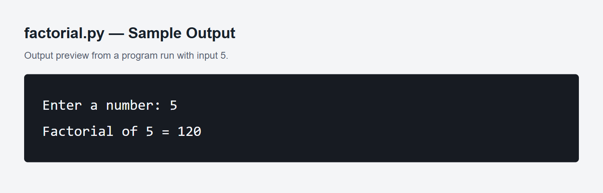

# Week 02 – Factorial of a Number

A Python program that finds the factorial of a number entered by the user.

## Problem Statement

The factorial of a non-negative whole number is the product of all whole numbers from 1 up to that number. For example, `5! = 1 × 2 × 3 × 4 × 5 = 120`. The factorial of 0 is 1.

## How to Run

Open a terminal in the project folder and run:

```bash
python factorial.py
```

On systems that use `python3`, run `python3 factorial.py` instead.

Enter a whole number greater than or equal to 0 when prompted.

## Sample Input and Output

```text
Enter a number: 5
Factorial of 5 = 120
```

## How It Works

The result starts at 1. A `for` loop multiplies it by each number from 2 up to the entered number. For 0 and 1, the loop is skipped and the result stays 1.

Negative numbers, decimal values, and text inputs display an error message.

## Output Screenshot

The image below shows an output preview captured from a run with input `5`.



## Tech Used

- Python 3.
- No external packages required.
